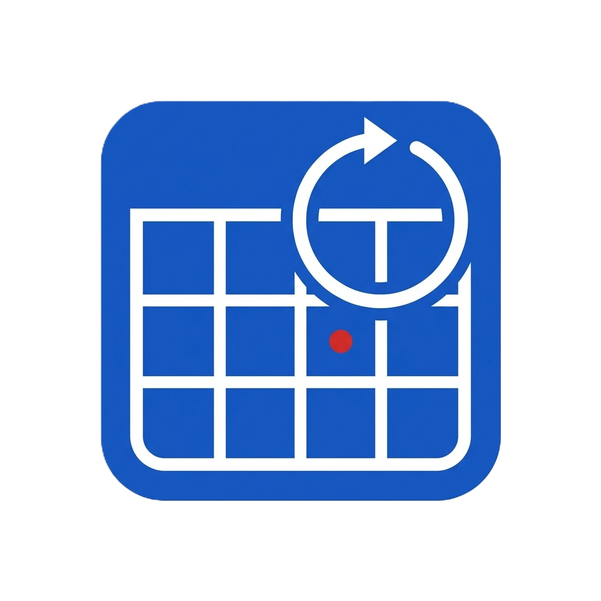

# Semestria

**Schulnetz-Prüfungen und Termine automatisch in Outlook.**

---

Semestria liest Prüfungen und Schultermine aus dem persönlichen Schulnetz-iCal-Feed und schreibt sie automatisch in den Outlook-Kalender – ohne manuelles Kopieren.

## Features

- 📅 Synchronisiert Prüfungen und Termine direkt aus dem Schulnetz-iCal
- 🔒 Feed-URL wird verschlüsselt lokal gespeichert (Windows DPAPI)
- 🗓️ Schreibt Events in den Outlook-Kalender via Microsoft Graph API
- 🖥️ Läuft im Hintergrund als System-Tray-App

## Download

**[→ Semestria im Microsoft Store](https://apps.microsoft.com/detail/9NJV8F0X7XMZ)**

Alternativ: `.msix`-Datei unter [Releases](../../releases) (Sideloading erforderlich).

## Tech Stack

| | |
|---|---|
| UI | WPF · .NET 9 · ModernWpfUI |
| Kalender | Microsoft Graph API v5 · MSAL |
| iCal | Ical.Net 5 |
| Sicherheit | DPAPI (lokale Verschlüsselung) |
| Distribution | MSIX · Microsoft Store |

## Changelog

### 04.09.2026
- [ ] Outlook-Kalender-Integration (Microsoft Graph)
- [ ] Titel kürzen (max. Zeichenlimit)
- [ ] Filter verbessern

### 28.08.2026
- [x] Projekt geplant und Architektur definiert
- [x] iCal-Parser und Event-Klassifikation (Prüfung / Termin)
- [x] Feed-URL-Verschlüsselung mit DPAPI
- [x] App im Microsoft Store veröffentlicht
